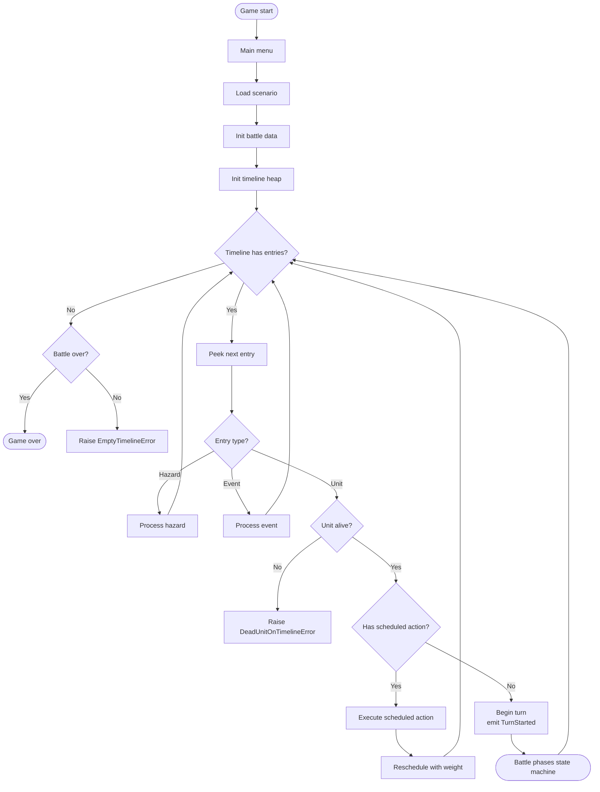
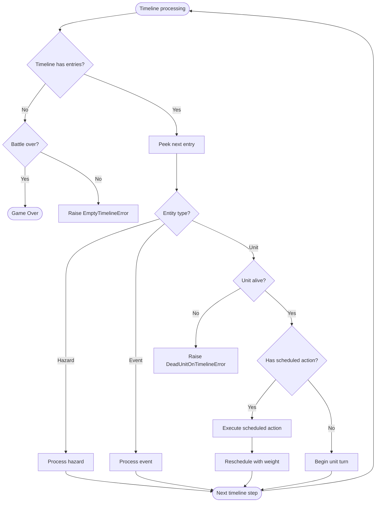
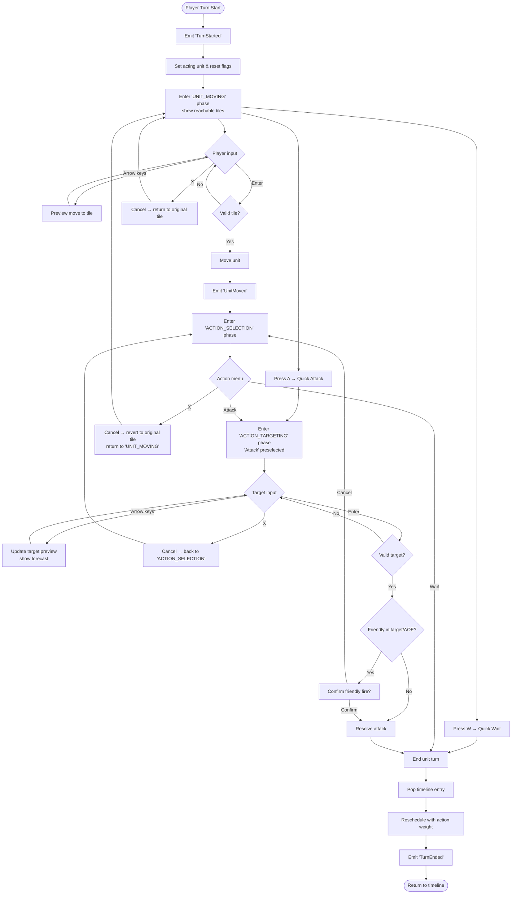

# Grimdark SRPG - Comprehensive Turn Flow

## Overview
The Grimdark SRPG uses a **timeline-based combat system** where units act based on action weights and speed rather than traditional turn-based rounds.
The system features:

- **Timeline Queue**: Priority queue ordering units by execution time
- **Action Weights**: Actions have time costs affecting next turn timing
- **Event-Driven Phases**: Phase transitions triggered by game events
- **Interrupt System**: Prepared actions that trigger on conditions

## Core Systems

### Timeline System
- **Timeline Queue**: Min-heap priority queue ordered by execution time
- **Action Scheduling**: `next_time = current_time + unit_speed + action_weight`
- **Entity Types**: Units, hazards, and events all share the timeline

### Phase Management
- **GamePhase**: Overall game states (MAIN_MENU → BATTLE → GAME_OVER)
- **BattlePhase**: Combat sub-phases managed by event-driven state machine
- **Phase Transitions**: Event-based rules trigger automatic transitions

## Turn Flow Diagrams

### Main Game Loop



### Timeline Processing



### Player Turn Flow



## System Architecture & Event Flow

### Core Architecture Principles

1. **Event-Driven Communication**: Systems communicate through events, not direct dependencies
2. **Timeline-Based Flow**: Units act on a priority queue based on speed and action weights
3. **Pull-Based Rendering**: Renderer pulls data each frame, doesn't listen to events
4. **Single Source of Truth**: GameState holds authoritative data, managers orchestrate behavior

### System Responsibilities

**TimelineManager**
- **Owns**: Timeline queue, unit scheduling, activation flow
- **Drives**: Main game progression, unit activation sequence
- **Emits**: Timeline and unit activation events
- **Listens**: Unit defeated events (for cleanup)

**EventManager**
- **Owns**: Event queue, subscriber registry, event routing
- **Drives**: Inter-system communication
- **Pattern**: Central message bus with priority queuing

**PhaseManager**
- **Owns**: Battle phase state machine
- **Drives**: Phase transitions based on events
- **Listens**: All game events that trigger phase changes

**UIManager**  
- **Owns**: Overlays, banners, dialogs, modal UI state
- **Drives**: UI element lifecycle
- **Listens**: Phase changes for automatic UI updates
- **Pattern**: Reactive to game state, doesn't drive game flow

**RenderBuilder**
- **Owns**: Render context construction
- **Drives**: Nothing (pure data transformation)
- **Pattern**: Pulls from GameState and managers each frame
- **No event subscriptions**: Stateless transformation layer

**InputHandler**
- **Owns**: User input processing, input-to-action mapping
- **Drives**: Player actions through event emission
- **Emits**: Action events based on user input

**CombatManager**
- **Owns**: Combat orchestration, targeting validation
- **Drives**: Combat resolution flow
- **Listens**: Combat-related events

### Data Flow Patterns

```
USER INPUT → InputHandler → Events → PhaseManager → State Changes
                              ↓
                         EventManager
                              ↓
                    All System Subscribers
                              
RENDERING:  GameState → RenderBuilder → RenderContext → Renderer
            (pulled each frame, not event-driven)

TIMELINE:   TimelineManager → Unit Activation → Events → Systems React
```

### Key Invariants

1. **Timeline Consistency**: Dead units never exist in timeline
2. **Phase Coherence**: Only one battle phase active at a time
3. **Event Ordering**: Events processed by priority, then timestamp
4. **Render Independence**: Rendering never modifies game state
5. **Manager Isolation**: Managers communicate only through events

### Decision Points & Ownership

| Decision | Owner | Triggers |
|----------|-------|----------|
| Unit activation order | TimelineManager | Timeline queue state |
| Phase transitions | PhaseManager | Game events |
| UI element visibility | UIManager | Phase changes |
| Combat resolution | CombatManager | Attack actions |
| Victory/defeat | ObjectiveManager | Game state conditions |
| Render frame content | RenderBuilder | Frame tick (pull) |

### Common Patterns

**Adding a New Feature**:
1. Identify owning manager (or create new one)
2. Define events for state changes
3. Subscribe relevant systems to events
4. Ensure render builder can visualize state

**Debugging Flow Issues**:
1. Check event history in EventManager
2. Verify phase transitions in PhaseManager
3. Confirm timeline consistency in TimelineManager
4. Validate UI state in UIManager

**System Communication**:
- **Loosely Coupled**: Use events for non-critical updates
- **Direct Calls**: Only for initialization and tightly coupled operations
- **State Queries**: Pull from GameState, never push
